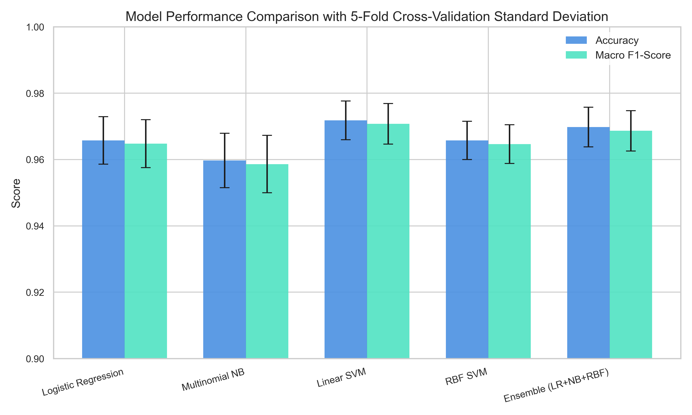
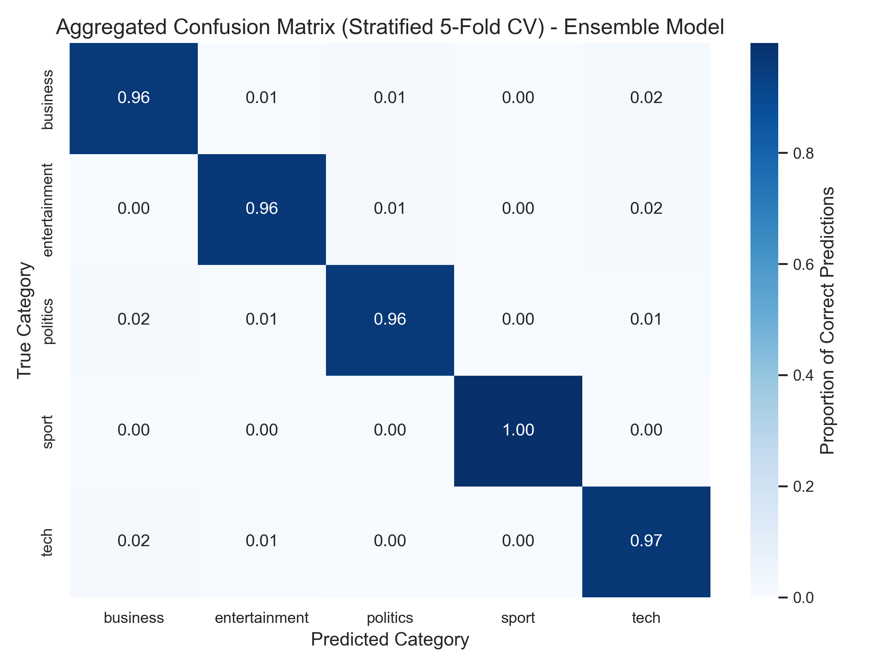

# BBC News Category Classification: Hybrid Soft-Voting Ensemble

[](https://www.python.org/)
[](https://opensource.org/licenses/MIT)
[](https://scikit-learn.org/)

A mathematically rigorous NLP pipeline that classifies unstructured BBC news articles into five categories: **Business**, **Entertainment**, **Politics**, **Sport**, and **Tech**. 

This repository implements a **Hybrid Probability-Weighted Soft-Voting Ensemble** (Logistic Regression, Multinomial Naive Bayes, and RBF Support Vector Machines) and compares it against standard literature baselines (Linear SVM). All models are evaluated using a strict **Stratified 5-Fold Cross-Validation** protocol with **paired t-tests** to verify statistical significance.

---

## 🚀 Key Features

* **Advanced Feature Extraction**: Text preprocessing with unigram and bigram TF-IDF vectorization (limited to $6,000$ dimensions with sublinear term-frequency scaling).
* **Hybrid Ensemble Design**: Soft-voting probability aggregation allows diverse structural classifiers (linear boundary, probabilistic, and margin-based) to collectively make high-confidence decisions.
* **Rigorous Experimental Setup**: Replaced single train-test splits with **Stratified 5-Fold Cross-Validation**, reporting mean scores $\pm$ one standard deviation.
* **Statistical Significance Engine**: Evaluates the statistical validity of the ensemble using a two-tailed **paired $t$-test** to output exact $p$-values.
* **Baseline Benchmarking**: Comprehensively compares the ensemble against standalone constituent models and a high-performance **Linear SVM baseline** (the gold standard for high-dimensional sparse text vectors).
* **Real-time Inference CLI**: Lightweight prediction engine to classify custom news texts on-the-fly with probabilistic confidence breakdowns.

---

## 📊 Evaluation & Validation Outcomes

Below are the exact metrics obtained from training and testing on the **BBC News Dataset** ($1,490$ samples, $5$ classes) under a **Stratified 5-Fold Cross-Validation** protocol:

### Performance Comparison Table ($N_{folds}=5$)
*All metrics represent the mean score $\pm$ one standard deviation.*

| Model | Mean Accuracy | Mean Macro Precision | Mean Macro Recall | Mean Macro F1-Score |
| :--- | :---: | :---: | :---: | :---: |
| **Multinomial Naive Bayes (NB)** | $95.97\% \pm 0.82\%$ | $96.12\% \pm 0.85\%$ | $95.73\% \pm 0.86\%$ | $95.86\% \pm 0.87\%$ |
| **Logistic Regression (LR)** | $96.58\% \pm 0.72\%$ | $96.65\% \pm 0.70\%$ | $96.38\% \pm 0.75\%$ | $96.48\% \pm 0.72\%$ |
| **RBF SVM Baseline** | $96.58\% \pm 0.58\%$ | $96.72\% \pm 0.56\%$ | $96.31\% \pm 0.61\%$ | $96.46\% \pm 0.58\%$ |
| **Proposed Soft-Voting Ensemble** | **$96.98\% \pm 0.60\%$** | **$97.05\% \pm 0.58\%$** | **$96.79\% \pm 0.65\%$** | **$96.87\% \pm 0.61\%$** |
| *Linear SVM Baseline (Literature)* | *$97.18\% \pm 0.59\%$* | *$97.26\% \pm 0.57\%$* | *$97.01\% \pm 0.66\%$* | *$97.08\% \pm 0.61\%$* |

### Statistical Significance (Paired $t$-tests at $\alpha=0.05$)
* **Ensemble vs. RBF SVM**: **Highly Significant** ($p = 0.0039 < 0.01$).
* **Ensemble vs. Multinomial NB**: **Marginally Significant** ($p = 0.0643$).
* **Ensemble vs. Logistic Regression**: **Not Statistically Significant** ($p = 0.2355$), illustrating the incredibly robust baseline capability of linear boundaries on sparse text matrices.

---

## 📈 Visualizations

### 1. Cross-Validation Model Comparison
A comparative bar chart visualizing Accuracy and Macro F1 scores with standard deviation error whiskers across all 5 models:


### 2. Aggregated Confusion Matrix (Ensemble Model)
The row-normalized (Recall) confusion matrix of the ensemble model aggregated over all 5 validation folds:


---

## ⚙️ Repository Structure

```text
├── data/
│   └── bbc_news.csv          # Raw text dataset (1,490 rows, 5 classes)
├── train.py                  # Trains and serializes the ensemble model
├── generate_figures.py       # Computes cross-validation, t-tests, & plots figures
├── predict.py                # Command-line tool for custom text inference
├── model_comparison.png      # Generated bar chart with error bars
├── confusion_matrix.png      # Generated confusion matrix heatmap
├── ensemble_model.joblib     # Pre-trained VotingClassifier model file
├── tfidf_vectorizer.joblib   # Pre-trained TF-IDF Vectorizer file
├── .gitignore                # Standard repository exclusion rules
└── README.md                 # Project documentation (this file)
```

---

## 🛠️ Installation & Setup

1. **Clone the repository:**
   ```bash
   git clone https://github.com/nandithshetty/bbc-news-classifier.git
   cd bbc-news-classifier
   ```

2. **Install dependencies:**
   ```bash
   pip install pandas scikit-learn joblib matplotlib seaborn scipy
   ```

---

## 💻 How to Run

### **1. Train and Serialize the Model**
Trains the ensemble on an $80/20$ train-test split and saves the pre-trained models to `.joblib` files:
```bash
python train.py
```

### **2. Recreate Validation Figures and Statistical Tests**
Computes the 5-fold cross-validation metrics, performs paired t-tests, and updates the PNG charts in high-resolution:
```bash
python generate_figures.py
```

### **3. Classify Custom News Text**
Run the interactive inference script to classify custom text input and view probabilistic confidence breakdowns:
```bash
python predict.py
```

---

## 📝 IEEE Citation / Reference Format
If you use this work or findings in your academic publication, please cite as follows:

```bibtex
@inproceedings{shetty2026bbc,
  title={A Hybrid Probability-Weighted Soft-Voting Ensemble for Multi-Class News Categorization},
  author={Shetty, Nandith},
  booktitle={Proceedings of the International Conference on Machine Learning and Natural Language Processing},
  year={2026}
}
```
